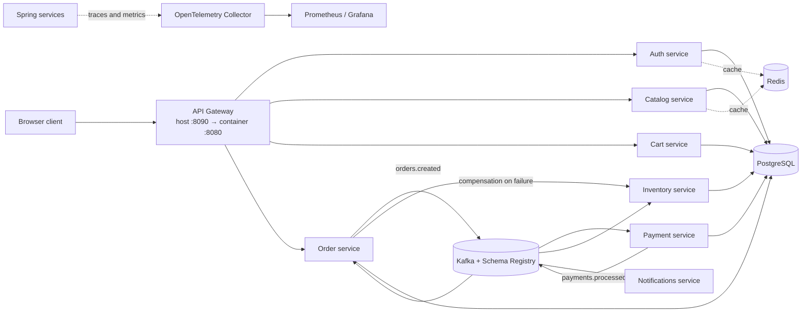

# ShopSphere Microservices

A Java microservices sample for exploring service boundaries, synchronous APIs, Kafka events, caching, authentication, container delivery, and observability. It is a learning/demo project; the repository does not claim production traffic, benchmark results, or operational SLAs.

## Architecture



The app Compose file starts the Spring services, Eureka, Config Server, and OTEL Collector. PostgreSQL, Redis, Kafka, and Schema Registry are external prerequisites; the app containers reach those local services through `host.docker.internal`.

## Stack in this repository

- Java 25; Spring Boot 3.5.0; Spring Cloud 2025.0.0
- Spring Boot services: API Gateway, auth, catalog, inventory, cart, order, payment, notifications, Config Server, and Eureka Server
- PostgreSQL/JPA, Redis caching, JWT resource-server authentication
- Kafka with Avro and Schema Registry; the documented checkout flow includes event deduplication and failure compensation
- Docker Compose, Actuator/Prometheus metrics, OpenTelemetry traces/metrics, Resilience4j, and a Spring Cloud Contract test scaffold

These versions describe the checked-in project configuration, not Java 27 or Spring Boot 4.

## Build and run on Windows

Prerequisites: JDK 25, Maven, Docker Desktop, and local PostgreSQL (5432), Redis (6379), Kafka (9092/29092), and Schema Registry (8084). Configure those services to accept connections from the Docker host as expected by `microservices/docker-compose.app.yml`.

1. Create a local-only environment file and replace every placeholder with values for your local services:

   ```powershell
   Copy-Item microservices/.env.example microservices/.env
   notepad microservices/.env
   ```

2. Build the service jars:

   ```powershell
   mvn -f microservices/pom.xml clean package -DskipTests
   ```

3. Start the app services:

   ```powershell
   docker compose --env-file microservices/.env -f microservices/docker-compose.app.yml up --build -d
   ```

4. Open the UI at <http://localhost:8090/>. The gateway maps host port 8090 to container port 8080.

5. Check service state and logs:

   ```powershell
   docker compose --env-file microservices/.env -f microservices/docker-compose.app.yml ps
   docker compose --env-file microservices/.env -f microservices/docker-compose.app.yml logs -f --tail 100
   ```

The repository does not include a Compose file that provisions PostgreSQL, Redis, Kafka, or Schema Registry. Start and verify those dependencies before starting the application containers.

## Monitoring

The application Compose file starts the OTEL Collector. Prometheus and Grafana are a separate stack:

```powershell
docker compose --env-file microservices/.env -f microservices/docker-compose.monitoring.yml up -d
```

Prometheus is at <http://localhost:9090>; Grafana is at <http://localhost:3000>. Set the local Grafana password in `microservices/.env`.

## Repository layout

- `microservices/*-service/` — independently packaged Spring services
- `microservices/api-gateway/` — browser/API entry point
- `microservices/config-server/`, `microservices/config-repo/` — externalized configuration
- `microservices/eureka-server/` — service discovery
- `microservices/docker-compose.app.yml` — application containers
- `microservices/docker-compose.monitoring.yml` — Prometheus and Grafana
- `microservices/monitoring/` — Prometheus and OTEL Collector configuration
- `microservices/README.md` — service map, local setup, and API/event walkthrough

## Security notes

`microservices/.env` is ignored by Git. Do not commit real passwords, JWT signing keys, access tokens, or production configuration. The SQL seed data is for local demonstration only. If any credential that was previously committed was reused outside a disposable local environment, rotate it; removing it from the current files does not erase earlier Git history.
